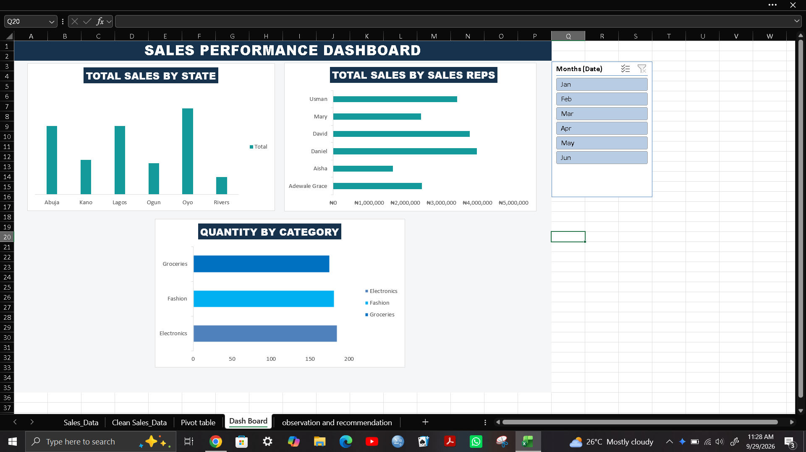

# Sales Performance Dashboard (Excel)

A practice project from my data analytics training at Bitnox Technology: clean a sales dataset, analyze it, and build an interactive dashboard in Excel.

## What's in the workbook
- **Sales_Data**: the original raw data
- **Clean Sales_Data**: cleaned data with Total_Sales, Sales Category and Email columns
- **Pivot table**: the pivot tables behind the charts, including the top 2 months
- **Dash Board**: three PivotCharts (sales by state, sales by sales rep, quantity by product category) and a month slicer
- **observation and recommendation**: project background, observations, recommendations and the top 2 months

## What I did
- Fixed text casing, checked for duplicates (none found) and formatted prices as Nigerian Naira
- Renamed the sales rep "Grace" to "Adewale Grace"
- Added Total_Sales (Quantity x Unit_Price) and Sales Category (below ₦100,000 = Low Sales; ₦100,000 and above = High Sales)
- Generated an email for each rep from their name, state, quantity and @gmail.com
- Built pivot tables, three charts and a month slicer that filters all of them

## Key findings
- Total sales were ₦17,745,000 across 541 units (January to June)
- Oyo led sales (₦4.98M); Rivers and Ogun together made up less than 16%
- Daniel and David were the top reps; Aisha's sales were less than half of Daniel's
- Product categories were balanced: Electronics 185, Fashion 181, Groceries 175
- Units sold fell from 144 in January to 40 in May, then recovered to 133 in June
- Top 2 months by quantity: January (144) and June (133)

## Recommendations
- Find out what works in Oyo and Abuja and try it in Rivers and Ogun
- Investigate the April to May dip (season, stock or staffing)
- Focus on weak states and reps, since category sales are already balanced
- Pair weaker reps with top performers for mentoring

## Tools
Excel: data cleaning, formulas, PivotTables, PivotCharts, slicers

## Note
This is fictional practice data. Names, emails and prices are made up, so some prices (like a very cheap laptop) are not realistic.
